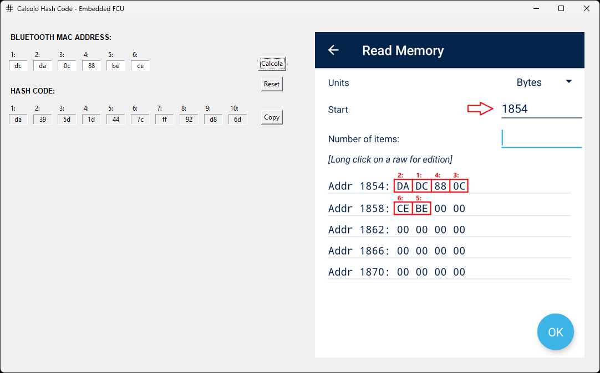

# Hash Code Calculator for Bluetooth MAC Address



## Overview

This application calculates a specific hash code based on a Bluetooth MAC address using a CRC-16 encryption algorithm. Designed for a specific application, it provides a user-friendly GUI interface with input validation and clipboard integration to copy the output result.

## Key Features

- **MAC Address Input**: 6-field hexadecimal input with automatic validation
- **Hash Code Generation**: 
  - 10-byte output display in hexadecimal format
  - CRC-16 MODBUS calculation algorithm
- **GUI Features**:
  - Clipboard integration (copy to clipboard)
  - Input reset functionality
  - Integrated intuitive explanatory screenshot

## Prerequisites

- Python 3.8+
- Required packages:
  ```bash
  pip install tkinterdnd Pillow pyperclip pyinstaller