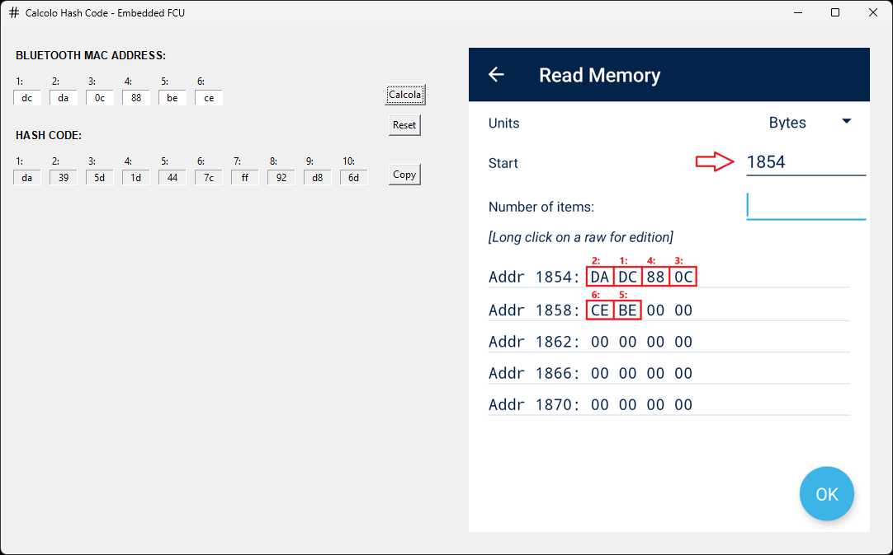

# Hash Code Calculator for Bluetooth MAC Address



## Overview

This application calculates a specific hash code based on a Bluetooth MAC address using a CRC-16 encryption algorithm. Designed for a specific application, it provides a user-friendly GUI interface with input validation and clipboard integration to copy the output result.

## Key Features

- **MAC Address Input**: 6-field hexadecimal input with automatic validation
- **Hash Code Generation**: 
  - 10-byte output display in hexadecimal format
  - CRC-16 MODBUS calculation algorithm
- **GUI Features**:
  - Clipboard integration (copy to clipboard)
  - Input reset functionality
  - Integrated intuitive explanatory screenshot

## Prerequisites

- Python 3.8+
- Required packages:
  ```bash
  pip install tkinter Pillow pyperclip pyinstaller
  ```


<span style="color: #00bfff;">

## Instructions to create an executable with PyInstaller

1. Install dependencies (if not already installed):
    ```bash
    pip install pyinstaller
    ```

2. Navigate to the directory containing your script:
    ```bash
    cd /path/to/your/project
    ```

3. Use PyInstaller to generate the executable:
    ```bash
    pyinstaller --onefile --windowed --icon="resources\icons\hash_icon.ico" --add-data "resources\icons\hash_icon.ico;." --add-data "resources\images\Screenshot_20250203_090509_ST25.png;." "src\Calcolo_Hash.py"
    ```
    - `--onefile`: Bundles everything into a single executable file.
    - `--windowed`: Prevents opening a terminal window when running the GUI (useful for Tkinter apps).

4. After running the above command, PyInstaller will generate a `dist/` folder containing the executable file.

</span>